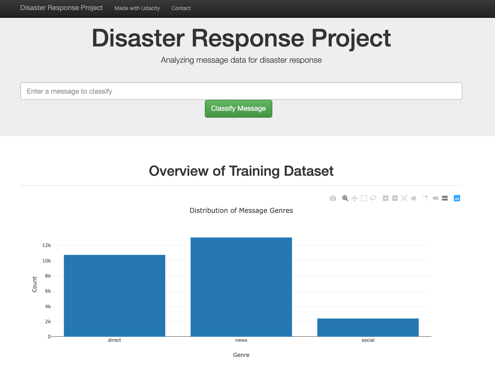
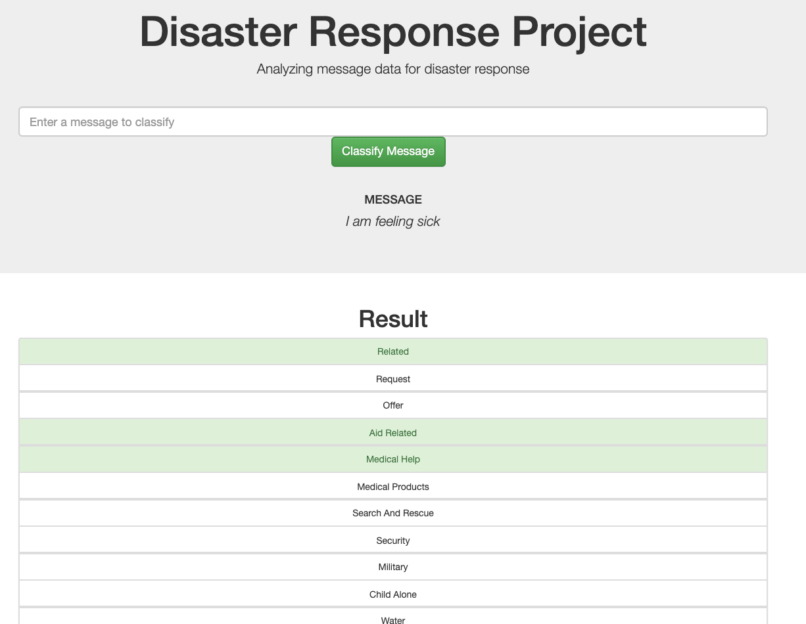

# Disaster Response Pipeline Project


This project to showcase Data Engineering skills including ETL and ML Pipeline preparation, utilising model in a Flask web app, and data visualisation.

### Instructions:
1. Run the following commands in the project's root directory to set up your database and model.

    - To run ETL pipeline that cleans data and stores in database
        `python data/process_data.py data/disaster_messages.csv data/disaster_categories.csv data/DisasterResponse.db`
    - To run ML pipeline that trains classifier and saves
        `python models/train_classifier.py data/DisasterResponse.db models/classifier.pkl`

2. Run the following command in the app's directory to run your web app.
    `python run.py`
    
3. Go to http://0.0.0.0:3001/

### Example:


```python
python process_data.py disaster_messages.csv disaster_categories.csv DisasterResponse.db

python train_classifier.py ../data/DisasterResponse.db classifier.pkl

python run.py
```

    

### Screenshots

Main page

   
     

After providinga text to classify:

 